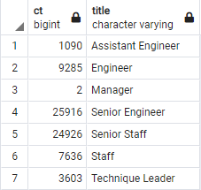
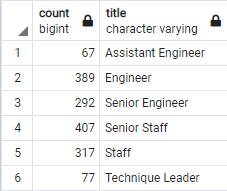
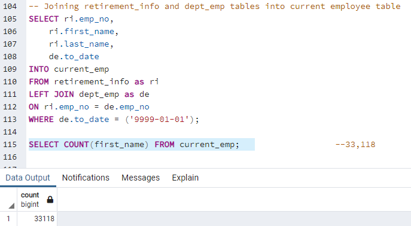
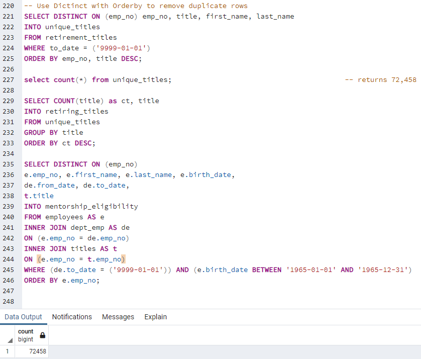

# Pewlett-Hackard-Analysis

## Overview

The two purposes of this project are to determine the employees eligible to retire soon and those eligible to participate in a mentorship program at the Pewlett Hackard company. The goal is to help Pewlett Hackard leadership prepare for a potential "silver tsunami" of many of their older employees retiring close together. 

## Results

The two deliverables that Pewlett Hackard requested were:

1. Number of Retiring Employees by Title

2. Employees Eligible for the Mentorship Program

There are four main takeaways from this analysis:

- There is very likely an error in this analysis. When we ran queries to establish the number of current employees, the result we returned was 33, 118 (see below) and yet the "Number of Retiring Employees by Title" totals to 72, 458, despite attempting to use the "SELECT DISTINCT ON" query to avoid this. 

### Current Employee Count

### "Retiring Titles" Query

- If we assume that our retults are indeed correct, there is a huge shortfall between the number of employees eligible to retire as a whole (72,458) and the number of such employees eligible for the mentorship program (1,549).

- When looked at by department, some departments are in more trouble than others. Both the Senior Engineer and Senior Staff groups have only approximately 1% of their retiring employees eligible for the program, whereas the Assistant Engineer group has 6% eligibility.
 
- The Manager group has no employees eligible for the mentorship program, despite having two employees eligible to retire soon.

## Summary

Instructions: 

[Provide high-level responses to the following questions, then provide two additional queries or tables that may provide more insight into the upcoming "silver tsunami."

    How many roles will need to be filled as the "silver tsunami" begins to make an impact?

    Are there enough qualified, retirement-ready employees in the departments to mentor the next generation of Pewlett Hackard employees?]

- I  don't feel that I can answer this at the moment because I believe that my analysis is incorrect.

